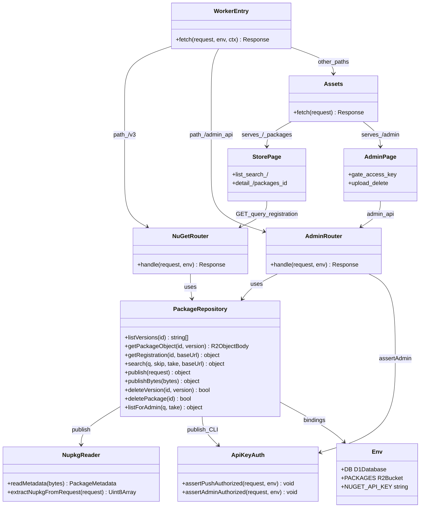
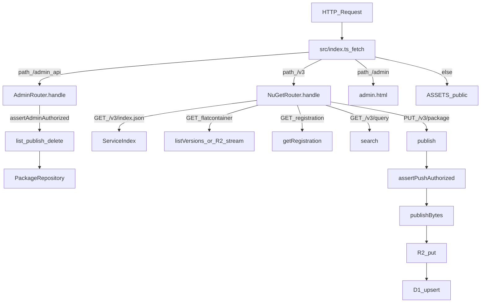
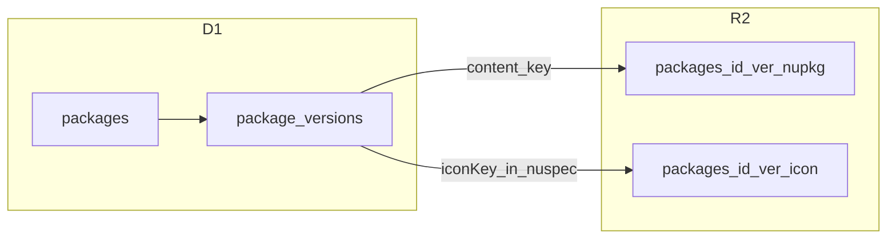

# PluginService NuGet V3 源结构

## 组件关系

```mermaid
classDiagram
  class WorkerEntry {
    +fetch(request, env, ctx) Response
  }
  class Assets {
    +fetch(request) Response
  }
  class StorePage {
    +list_search_/
    +detail_/packages_id
  }
  class AdminPage {
    +gate_access_key
    +upload_delete
  }
  class NuGetRouter {
    +handle(request, env) Response
  }
  class AdminRouter {
    +handle(request, env) Response
  }
  class PackageRepository {
    +listVersions(id) string[]
    +getPackageObject(id, version) R2ObjectBody
    +getRegistration(id, baseUrl) object
    +search(q, skip, take, baseUrl) object
    +publish(request) object
    +publishBytes(bytes) object
    +deleteVersion(id, version) bool
    +deletePackage(id) bool
    +listForAdmin(q, take) object
  }
  class NupkgReader {
    +readMetadata(bytes) PackageMetadata
    +extractNupkgFromRequest(request) Uint8Array
  }
  class ApiKeyAuth {
    +assertPushAuthorized(request, env) void
    +assertAdminAuthorized(request, env) void
  }
  class Env {
    +DB D1Database
    +PACKAGES R2Bucket
    +NUGET_API_KEY string
  }

  WorkerEntry --> NuGetRouter : path_/v3
  WorkerEntry --> AdminRouter : path_/admin_api
  WorkerEntry --> Assets : other_paths
  Assets --> StorePage : serves_/_packages
  Assets --> AdminPage : serves_/admin
  StorePage --> NuGetRouter : GET_query_registration
  AdminPage --> AdminRouter : admin_api
  NuGetRouter --> PackageRepository : uses
  AdminRouter --> PackageRepository : uses
  AdminRouter --> ApiKeyAuth : assertAdmin
  PackageRepository --> NupkgReader : publish
  PackageRepository --> ApiKeyAuth : publish_CLI
  PackageRepository --> Env : bindings
```

## 请求流程

```mermaid
flowchart TD
  req[HTTP_Request] --> entry[src/index.ts_fetch]
  entry -->|path_/v3| router[NuGetRouter.handle]
  entry -->|path_/admin_api| admin[AdminRouter.handle]
  entry -->|path_/admin| adminHtml[admin.html]
  entry -->|else| assets[ASSETS_public]
  admin -->|assertAdminAuthorized| adminOps[list_publish_delete]
  adminOps --> repo[PackageRepository]
  router -->|GET_/v3/index.json| index[ServiceIndex]
  router -->|GET_flatcontainer| flat[listVersions_or_R2_stream]
  router -->|GET_registration| reg[getRegistration]
  router -->|GET_/v3/query| search[search]
  router -->|PUT_/v3/package| pub[publish]
  pub --> auth[assertPushAuthorized]
  auth --> parse[publishBytes]
  parse --> r2[R2_put]
  r2 --> d1[D1_upsert]
```

## 存储布局

```mermaid
flowchart LR
  subgraph d1 [D1]
    packages[packages]
    versions[package_versions]
  end
  subgraph r2 [R2]
    nupkg[packages_id_ver_nupkg]
    icon[packages_id_ver_icon]
  end
  packages --> versions
  versions -->|content_key| nupkg
  versions -->|iconKey_in_nuspec| icon
```
